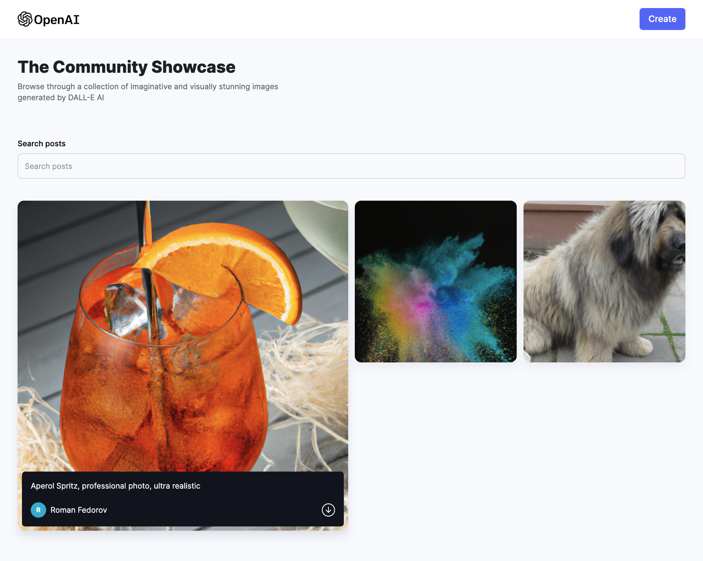

<h1>My DALL-E Clone App</h1>

Проект представляет собой Full Stack (MERN) приложение с возможностью генерации изображений по текстовому запросу с помощью Open AI.

*Ссылка на страницу в шапке проекта.*
___

### Реализованный функционал:
+ Возможность сгененировать изображение по текстовому запросу пользователя;
+ Поиск изображений по ключевому запросу;
+ Добавлена кнопка "Удивить меня" с заготовленными фразами для генерации изображения;
+ Роутинг запросов к OpenAI, отправка и получение изображений в/из MongoDB.

### Целью данного проекта было: 
+ Поработать с Open AI;
+ Получить опыт от работы с приемом и обработкой изображений с помощью библиотеки Cloudinary;
+ Настроить и подключить MongoDB, прописать роуты с помощью Node.js.

### В планах по доработке:
+ Добавить popup для увеличения изображений;
+ Задеплоить проект на персональный домен.